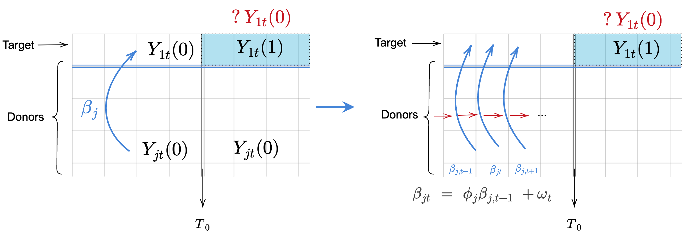

# Publications:

**Junzhe Shao**, Mingzhang Yin, Xiaoxuan Cai, Linda Valeri “Generalized Synthetic Control Method with State-space Model”, Short paper accepted to NeurIPS 2022 Workshop on [Causality for Real-world Impact](https://openreview.net/forum?id=OwyiIBIFCrn&referrer=%5Bthe%20profile%20of%20Junzhe%20Shao%5D(%2Fprofile%3Fid%3D~Junzhe_Shao1)) <a href="45.pdf#" class="download" title="PDF"> [PDF] </a>

Mona Alotaibi, **Junzhe Shao**, Michael W. Pauciulo, William C. Nichols, Anna R. Hemnes, Atul Malhotra, Nick H. Kim et al. ”Metabolomic Profiles Differentiate Scleroderma-PAH From Idiopathic PAH and Correspond With Worsened Functional Capacity”, [CHEST](https://doi.org/10.1016/j.chest.2022.08.2230) 2022 <a href="Chest_Junzhe.pdf#" class="download" title="PDF"> [PDF] </a>			

# Research Experience

## Synthetic Control Method:

I am working on a generalized synthetic control method with state-space model under the direct guidance of [Dr. Linda Valeri](https://www.lindavaleri.com/), [Dr. Mingzhang Yin](https://mingzhang-yin.github.io/) and advices from [Dr. David Blei](http://www.cs.columbia.edu/~blei/).
We propose a generalized synthetic control method with time-varying weights based on state-space model (GSC-SSM), allowing for a more flexible and accurate construction of counterfactual series. 

From classic synthetic control to our new method:

Results on German reunification data:

  
## Covariates Adaptive Design

Under the guidance of [Dr. Jingshen Wang](https://sites.google.com/berkeley.edu/jingshenwang/), I have also conducted research in sequential randomization under a high-dimensional setting. We investigated the theoretical properties of statistical methods to achieve covariates balance for randomized clinical trials and proposed a new setting for Pairwise Sequential Randomization with many covariates. We further showed better efficiency of this sequential randomization.

## Other Research Experience

I was a visiting student in UCSD during my third academic year under the supervision of Prof. Mohit Jain and Dr. Tao Long, working on the topic of Integrative High-Throughput Metabolomics Analysis of Pulmonary Arterial Hypertension Phenotypes and Outcomes.

In Peking University, I conducted my research on the topic of Image Based Age and Life Expectancy Prediction of C.elegans under Professor Jingdong Han’s supervision. In this project, I developed a deep learning model based on inception-ResNet-V2 for the image processing of microscopic pictures of Caenorhabditis elegans to predict their mortality and frailty.

